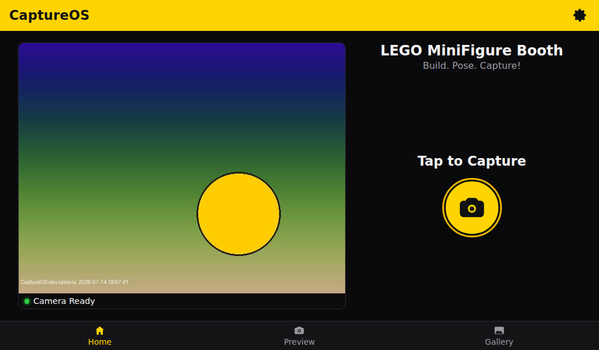
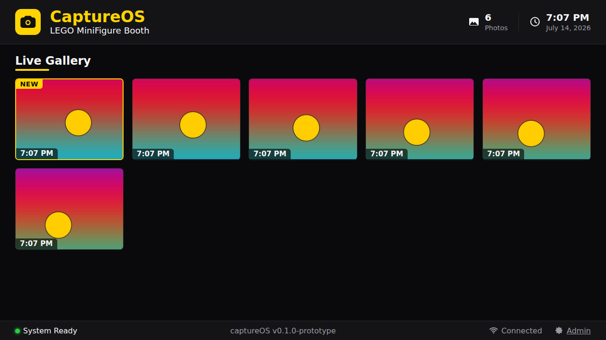

# CaptureOS

A modular, kiosk-oriented photo-booth platform for a Raspberry Pi with a
touchscreen and an external gallery display. The reference application is a
**LEGO MiniFigure Photo Booth**: tap to capture on the touch panel, accept or
retake, and the accepted photo appears on the wall display within a second.

Boots into a polished touch UI, captures high-quality photos, and publishes
them to a live gallery with no operator intervention. See
[`docs/ARCHITECTURE.md`](docs/ARCHITECTURE.md) for how the pieces fit together
and the design decisions behind them.

| Booth touchscreen | Wall gallery |
|---|---|
|  |  |

> Screenshots use the built-in synthetic **dev camera** (animated
> placeholder frames), so the whole stack runs on a laptop without a Pi.

## Services

| Directory | Service | Stack | Port |
|-----------|---------|-------|------|
| `frontend/` | Booth touch UI + wall gallery + admin | React, TypeScript, Vite | 80 via nginx (5173 in dev) |
| `backend/` | API, SQLite, gallery events, admin | Node 22+, Express, `node:sqlite` | 3000 |
| `camera-service/` | Camera hardware + image pipeline | Python 3.11+, Pillow, libcamera | 5000 |
| `deploy/` | Installer, launcher, nginx, systemd, desktop icon | — | — |

Each service runs independently and is restarted automatically by systemd if
it fails. Runtime state (photos, thumbnails, SQLite DB, logs, backups) lives
under `data/` (`/opt/captureos/data` on the Pi) — never inside the application
directories.

## Hardware (reference build)

- Raspberry Pi 5 (8 GB recommended), high-endurance microSD
- Arducam / CSI camera (libcamera-compatible)
- 10.1" 1024×600 HDMI touchscreen for the booth (USB touch, driver-free)
- A larger HDMI display for the gallery wall

## Install on a Raspberry Pi

Use **Raspberry Pi OS (64-bit) Desktop** on a Pi 5 (the kiosk needs a
graphical session). From a fresh install, one script does everything —
prerequisites, code, and the full install:

```bash
bash <(curl -fsSL https://raw.githubusercontent.com/arl-design/captureos/main/deploy/bootstrap.sh)
```

Or clone first and run it from the checkout:

```bash
git clone https://github.com/arl-design/captureos.git
cd captureos
./deploy/bootstrap.sh            # run as your normal user, not root
```

`bootstrap.sh` installs a recent Node (22.x from NodeSource — required for
`node:sqlite`) if the system's is too old, checks the camera, then runs
`deploy/install.sh`, which copies the app to `/opt/captureos`, builds the
frontend, configures nginx on port 80, enables the `captureos-camera` and
`captureos-backend` systemd services, and puts a **CaptureOS Photo Booth**
icon on the Desktop, in the app menu, and in autostart. Re-running it later
(after a `git pull`) upgrades in place without touching `data/`.

## One-tap launch

End users never need a terminal: tapping the desktop icon runs
`deploy/kiosk/captureos-launch.sh`, which ensures the services are up, waits
for `/api/health`, then opens two Chromium kiosk windows — the booth UI on the
**touchscreen** and the gallery on the **main / wall display**. The launcher
detects connected monitors via `xrandr` (largest panel → gallery, the other
→ booth touchscreen). If both windows land on the same screen, run
`captureos-launch.sh --list-displays` and set output names in
`~/.config/captureos/display.conf` (see `deploy/kiosk/display.conf.example`).
The same entry runs at boot via `~/.config/autostart`.

The installer surfaces three ways to launch, so you always have one:

- the **CaptureOS Photo Booth** icon on the Desktop,
- the **CaptureOS Photo Booth** entry in the application menu, and
- the `captureos` command in a terminal.

The first time you use the Desktop icon, some desktops ask you to trust the
launcher — allow it once (or right-click → *Allow Launching*). The installer
marks it trusted automatically where it can, but if the icon doesn't appear,
use the app-menu entry or run `captureos`.

After install, the desktop icon should launch with **one tap** (no Execute/Open
dialog, no password). If it still prompts, log out and back in once, or run
`/opt/captureos/trust-desktop-icon.sh`.

## Quick start (development, no Pi required)

The camera service detects missing camera hardware and switches to a
synthetic **dev camera**, so the whole stack runs on any machine (Node ≥ 22.5,
Python 3.11+ with Pillow):

```bash
# 1. Camera service
cd camera-service && python3 camera_service.py

# 2. Backend
cd backend && npm install && npm run dev

# 3. Frontend (proxies /api, /photos, /thumbnails to the backend)
cd frontend && npm install && npm run dev
```

Then open:

- Booth UI:  <http://localhost:5173/#/>
- Gallery:   <http://localhost:5173/#/gallery>
- Slideshow: <http://localhost:5173/#/slideshow>
- Admin:     <http://localhost:5173/#/admin> (default PIN **1234** — change it in Settings)

A **portable mode** also runs the whole booth on one port with no nginx: build
the frontend once (`cd frontend && npm run build`), then start the camera
service and `node backend/src/server.js` — the backend serves the built
frontend plus the `/api/*` routes on port 3000. `deploy/kiosk/captureos-launch.sh`
uses this automatically when there's no systemd install.

## API

Public routes (served at `/` by the backend, proxied under `/api/` by nginx):

| Route | Method | Purpose |
|-------|--------|---------|
| `/health` | GET | Service + camera status |
| `/preview` | GET | Live MJPEG preview stream |
| `/capture` | POST | Capture a photo (created `pending`) |
| `/accept` | POST `{id}` | Accept a pending photo into the gallery |
| `/retake` | POST `{id}` | Discard a pending photo and delete its files |
| `/gallery` | GET | Accepted photos, newest first (`?limit&offset`) |
| `/latest` | GET | Most recent accepted photo |
| `/settings` | GET / POST | Read / update booth settings |
| `/events` | GET | Server-sent events (`photo.accepted`, `photo.removed`, `settings.updated`) |

Admin routes live under `/api/admin/` (nginx restricts them to private LAN
addresses; a PIN login returning a bearer token protects them on top):
`POST /login`, `GET /diagnostics`, `GET /photos`, `DELETE /photos/:id`,
`GET|POST /settings`, `POST /pin`, `POST /backup`, `GET /backups[/:file]`,
`GET /logs`.

## Photo lifecycle

```
POST /capture           POST /accept
  camera + pipeline  ──►  pending  ──►  accepted  ──►  gallery (SSE push)
                            │
                            └─ POST /retake ──► discarded (files deleted)
```

Pending photos abandoned mid-review are swept automatically after 5 minutes.

## License

[MIT](LICENSE)
